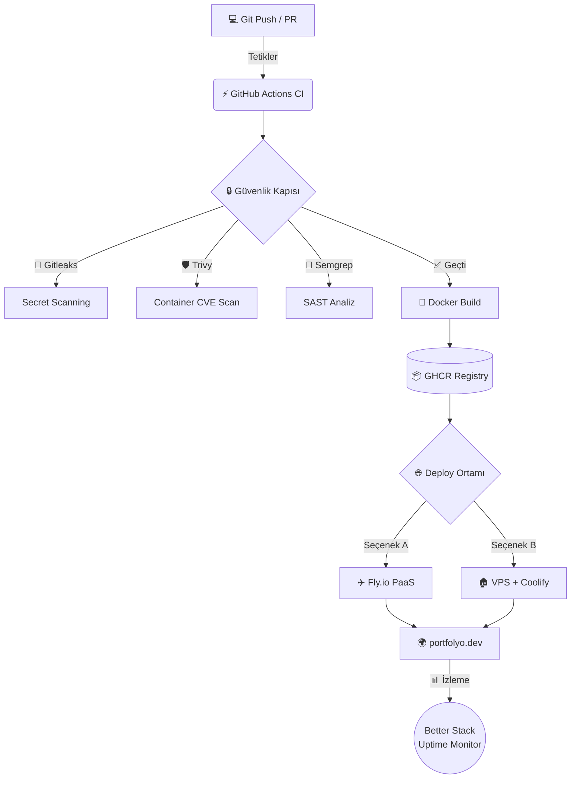

<div align="center">

# 🚀 Kişisel Portfolyo — Leyla Kemenci

**Next.js 15 · Tailwind CSS · Docker · GitHub Actions · Fly.io**

[](https://github.com/leylakemenci/web-hafta10/actions)
[](./Dockerfile)
[](https://nextjs.org)
[](LICENSE)

> Mezuniyet sonrası iş başvurularında kullanmak üzere geliştirilen, **DevOps pipeline'ı** ile birlikte canlıya alınan kişisel portfolyo sitesi.

---

</div>

## 📸 Önizleme

| Hero | Projeler | İletişim |
|:---:|:---:|:---:|
| Modern tasarım | 3+ gerçek proje | Canlı iletişim formu |

---

## 🏗️ Mimari



---

## ✨ Sayfa Bölümleri

| # | Bölüm | İçerik |
|---|-------|--------|
| 1 | **Hero** | Ad + Rol + Pitch + CTA butonları |
| 2 | **Projeler** | 3 gerçek proje, tech stack, GitHub + canlı linkler |
| 3 | **Yetkinlikler** | Frontend / Backend / DevOps kategorileri |
| 4 | **Deneyim** | Staj, freelance, open-source katkıları |
| 5 | **Eğitim** | BEÜ Bilgisayar Müh. + GPA + Önemli dersler |
| 6 | **Hobiler** | 4 hobi ile kişisel marka sinyali |
| 7 | **İletişim** | E-posta + GitHub + LinkedIn |

---

## 🛠️ Teknoloji Yığını

**Frontend:** Next.js 15 (App Router) · TypeScript · Tailwind CSS v4 · React Icons  
**DevOps:** Docker (multi-stage, standalone) · GitHub Actions · GHCR  
**Güvenlik:** Gitleaks · Trivy · Semgrep  
**Deploy:** Fly.io / Docker Compose  
**Monitoring:** Better Stack Uptime

---

## 🚀  Yerel Çalıştırma

### Geliştirme Modu
```bash
git clone https://github.com/leylakemenci/web-hafta10.git
cd web-hafta10/portfolyo
npm install
npm run dev
```
Tarayıcıda aç: [http://localhost:3000](http://localhost:3000)

### Docker ile Çalıştırma
```bash
docker-compose up --build
```
Sağlık kontrolü: [http://localhost:3000/api/health](http://localhost:3000/api/health)

---

## 🌐 Canlıya Çıkarma

### Fly.io (Ücretsiz — Önerilen Hızlı Yol)
```bash
fly auth login
fly launch        # İlk kez
# veya
fly deploy        # Sonraki güncellemeler
```

### VPS + Coolify (Sektör Standardı)
1. Hetzner CX22 VPS al (€4.51/ay)
2. Coolify kur: `curl -fsSL https://cdn.coollabs.io/coolify/install.sh | bash`
3. Coolify panelinden bu repo'yu bağla → otomatik deploy

---

## 🔒 DevSecOps Pipeline

Her `git push` / Pull Request'te sırasıyla çalışır:

```
🔑 Gitleaks        → Commit'lerde şifre/token sızdı mı?
🔬 Semgrep         → Statik kod analizi (SAST)
🐳 Docker Build    → Image oluştur
🛡️ Trivy           → Container güvenlik açıkları (CRITICAL = ❌ block)
📦 GHCR Push       → Temiz image registry'ye gönder
```

---

## 📊 Sağlık & İzleme

`GET /api/health` yanıtı:
```json
{
  "status": "ok",
  "uptime": 3600.24,
  "timestamp": "2026-04-27T11:00:00.000Z"
}
```

Better Stack izleme kurulumu:
1. [betterstack.com](https://betterstack.com) → **New Monitor**
2. URL: `https://leyla.dev/api/health`
3. Kontrol aralığı: **30 saniye**

---

## 🤖 AI Kullanım Beyanı

Bu projenin geliştirilmesinde (mimari tasarım, kod üretimi ve DevOps yapılandırması) **Google Gemini Agentic AI** kullanılmıştır. Üretilen tüm kod, kalite ve güvenlik standartlarına göre gözden geçirilmiş ve kişiselleştirilmiştir.

---

## 📄 Lisans

MIT © 2026 [Leyla Kemenci](https://github.com/leylakemenci)
